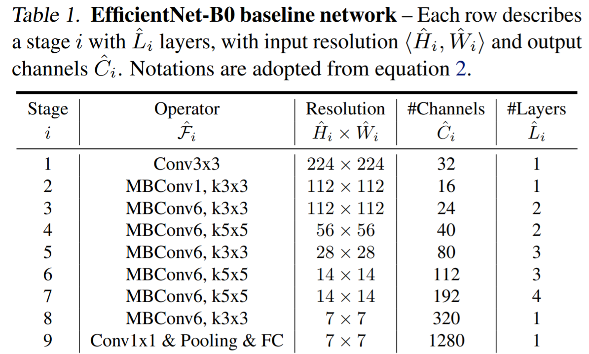

# Etude étique de EfficientNet

Nous allons étudier EfficientNet v1 et v2 afin d'évaluer leur caractère éthique.

## Le réseau de neurones EfficientNet

EfficientNet est un réseau de neurones convolutif créé par Google, utilisable pour la classification d'images. La [première version](https://arxiv.org/pdf/1905.11946.pdf) est sortie est 2019, la [seconde](https://arxiv.org/pdf/2104.00298.pdf) en 2021.

La seconde version n'ayant pas encore été déployée, notre projet se base pour l'instant sur la première version d'EfficientNet. Ce réseau de neurones repose sur une certaine structure de base. 

Cette architecture peut être aggrandie selon un certain coefficient, le _compound_.

## Le dataset UTKFace

Nous allons tout d'abord nous pencher sur le dataset UTKFace, disponible à l'adresse [suivante](https://susanqq.github.io/UTKFace/).

Le dataset contient des images brutes de plus de 23 000 visages dans des environnements divers, avec un seul visage par image. Le dataset contient également ces mêmes images centrées et rognées de taille 200x200x3. 

Les images sont catégorisées par âge, sexe et origine éthnique. Le nom de ces images est de la forme ``[age]_[sexe]_[origine_ethnique]_[date&time].jpg``.

- ``[age]`` est un entier entre 0 et 116 indiquant l'âge 
- ``[sexe]`` est 0 pour les hommes et 1 pour les femmes
- ``[origine_ethnique]`` est un entier entre 0 et 4, correspondant à Blanc, Noir, Asiatique, Indien, et autres (Hispanique, Latino, Moyen-Orient, Arabe...).
- ``[date&time]`` est au format yyyymmddHHMMSSFFF, correspondant à l'instant où la photo a été enregistrée dans le dataset UTKFace

## Le projet

### Structure

    ├── notebooks                    
    │   ├── UTKFace
    |   │   ├── analyse_dataset.ipynb
    |   │   └── visualize_intermediate_layers.ipynb
    │   └── archive
    ├── src
    │   ├── ethicnet
    |   │   ├── ...
    |   │   └── ...
    │   └── ...
    ├── .gitignore
    ├── EfficientNetB0.png
    ├── README.md
    └── requirements.txt

### Installation
Il vous suffit de cloner ce projet, de créer un environnement virtuel, de l'activer, et de lancer ``pip install -r requirements.txt``.

### Notebooks

Dans le notebook ``analyse_dataset.ipynb``, nous observons la répartition des âges, sexes et origines éthniques du UTKFace dataset.

Dans le notebook ``visualize_intermediate_layers.ipynb``, nous visualisons ce que voient les neurones des couches internes de EfficientNet pour certains visages, et pour des ensembles de visages de personnes de même sexe, âge et origine éthnique.  